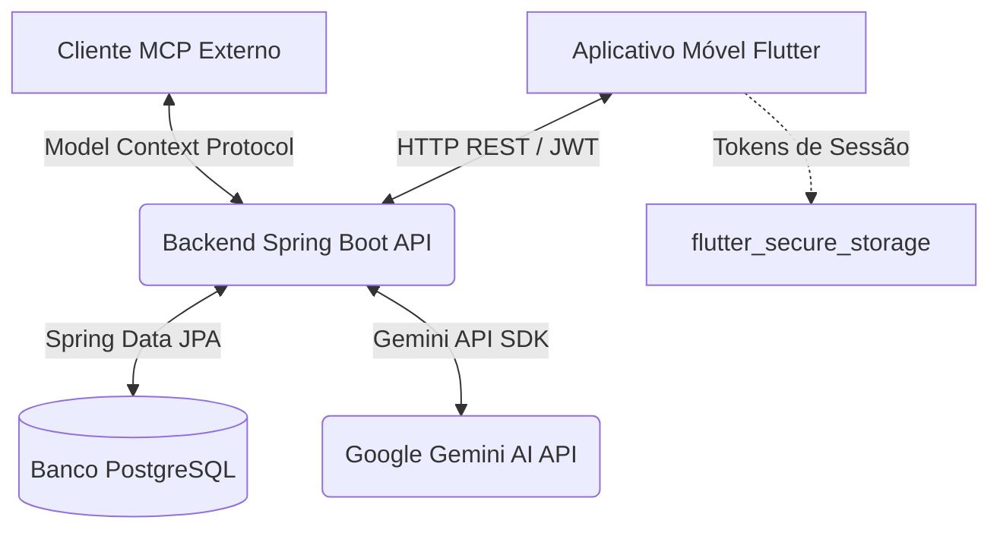

# 🦷 MiniProntuário Odontológico — Sistema Integrado (Frontend & Backend)

O **MiniProntuário Odontológico** é um sistema completo e seguro para o gerenciamento de prontuários clínicos odontológicos, composto por um aplicativo móvel desenvolvido em **Flutter** (Frontend) e uma API REST desenvolvida em **Spring Boot** (Backend). 

Ele foi projetado para permitir que dentistas gerenciem seus perfis profissionais, realizem o controle de pacientes (anamnese, medicamentos, alergias e doenças sistêmicas) e registrem procedimentos odontológicos de forma cronológica, com suporte a **Inteligência Artificial (IA)** para análise de risco clínico e integração via **Model Context Protocol (MCP)**.

---

## 📐 Arquitetura do Sistema

O projeto segue um modelo de arquitetura cliente-servidor distribuído com comunicação via **HTTP REST** e segurança baseada em **Stateless JWT**:



### Princípios de Design & Fluxo de Dados:
- **Zero Persistência de Domínio Local**: Para conformidade com segurança e integridade de dados, o aplicativo móvel não armazena dados de pacientes ou procedimentos localmente. Todo o domínio reside no banco de dados centralizado.
- **Armazenamento Seguro de Sessão**: As chaves de acesso JWT (`accessToken` e `refreshToken`) são persistidas no dispositivo móvel de forma criptografada usando as ferramentas nativas de segurança do OS (Keychain no iOS e Keystore no Android) via `flutter_secure_storage`.
- **Renovação Automática de Token**: O cliente HTTP do Flutter implementa um interceptor inteligente. Quando um token de acesso expira (HTTP 401), o aplicativo realiza uma requisição de renovação silenciosa com o refresh token e repete a chamada falhada sem interromper a experiência do usuário.
- **Isolamento Multitenant**: Cada dentista logado visualiza e manipula exclusivamente os seus próprios registros de pacientes e procedimentos cadastrados.

---

## 🛠️ Tecnologias Utilizadas

### Frontend (Aplicativo Móvel)
- **Framework**: [Flutter SDK 3.x](https://flutter.dev)
- **Linguagem**: [Dart 3.x](https://dart.dev)
- **Gerenciamento de Estado**: [Riverpod v3 (Notifier/AsyncNotifier APIs)](https://riverpod.dev)
- **Comunicação HTTP**: [Dio](https://pub.dev/packages/dio) (com suporte a timeouts, interceptores de cabeçalhos e re-tentativas)
- **Persistência de Sessão**: [flutter_secure_storage](https://pub.dev/packages/flutter_secure_storage)
- **Roteamento**: [GoRouter](https://pub.dev/packages/go_router)

### Backend (API REST)
- **Framework**: [Spring Boot 3.3.x](https://spring.io/projects/spring-boot) (Java 17+)
- **Segurança**: [Spring Security](https://spring.io/projects/spring-security) com geração e assinatura de tokens JWT
- **Persistência de Dados**: [Spring Data JPA](https://spring.io/projects/spring-data-jpa) & Hibernate
- **Banco de Dados**: [PostgreSQL](https://www.postgresql.org) (Desenvolvimento e Produção) e [H2 Database](https://www.h2database.com) (Ambiente de Testes)
- **Gerenciamento de Schemas**: [Flyway](https://flywaydb.org) (Migrações versionadas de tabelas e constraints)
- **Documentação**: [Springdoc OpenAPI (Swagger)](https://springdoc.org)
- **Integração de IA**: API do Gemini para relatórios automatizados de risco clínico

---

## 📋 Funcionalidades Principais

1. **Autenticação Avançada**:
   - Registro de dentistas com validação estrutural de CPF, CRO (Conselho Regional de Odontologia) e e-mail único.
   - Login seguro com geração de par de tokens (Access Token + Refresh Token).
   - Endpoint `/auth/me` para resgate dinâmico do perfil ativo.
   - Fluxo de logout que invalida as sessões no servidor.

2. **Gerenciamento de Pacientes (CRUD)**:
   - Cadastro detalhado contendo: Nome completo, CPF, Data de Nascimento, Telefone, Alergias, Doenças Sistêmicas e Medicamentos em uso.
   - Validações rígidas de CPF e Data de Nascimento coerentes no servidor e na interface gráfica.

3. **Histórico e Controle de Procedimentos**:
   - Cadastro de tratamentos odontológicos informando: Descrição, Custo do procedimento, Status (Planejado/Concluído) e Dente tratado.
   - Suporte à **Notação Dentária Internacional FDI** (quadrantes e numeração dos dentes).
   - Linha do tempo (Timeline) interativa e ordenada cronologicamente por paciente.

4. **Análise de Risco Clínico por Inteligência Artificial**:
   - Integração direta com IA que lê o prontuário do paciente (anamnese, medicamentos atuais, alergias) e gera um relatório imediato destacando contraindicações de anestésicos, interações medicamentosas perigosas e cuidados adicionais necessários para o tratamento.

5. **Servidor MCP Integrado**:
   - Exposição de ferramentas padronizadas para agentes de IA consultarem anamneses e sugerirem planos de tratamento dinâmicos baseados no histórico clínico.

---

## 🏁 Como Rodar o Projeto

Para testar e executar o MiniProntuário completo em sua máquina local, siga os passos abaixo:

### Passo 1: Executar o Backend

#### Pré-requisitos do Backend:
- Java JDK 17 ou superior instalado.
- Servidor PostgreSQL instalado e rodando.

#### Configuração:
1. Abra o PostgreSQL e crie um banco de dados vazio chamado `miniprontuario_db`.
2. Configure as credenciais do seu banco de dados local editando o arquivo `application.yml` localizado em:
   `c:\miniprontuario\miniprontuario-backend\miniprontuario-backend\src\main\resources\application.yml`

   Substitua os campos de `username` e `password` com os do seu PostgreSQL:
   ```yaml
   spring:
     datasource:
       url: jdbc:postgresql://localhost:5432/miniprontuario_db
       username: seu_usuario_postgres
       password: sua_senha_postgres
   ```

#### Rodando a API:
Navegue até a pasta do backend (`c:\miniprontuario\miniprontuario-backend\miniprontuario-backend`) em seu terminal e execute:

- **No Windows**:
  ```powershell
  .\mvnw.cmd spring-boot:run
  ```
- **No Linux / macOS**:
  ```bash
  ./mvnw spring-boot:run
  ```

> [!NOTE]
> O banco de dados PostgreSQL terá suas tabelas e estruturas criadas de forma automatizada pelo Flyway assim que a aplicação iniciar.

A API estará disponível em: **`http://localhost:8080`**.
Para verificar a documentação interativa com o Swagger UI, acesse: 👉 **`http://localhost:8080/swagger-ui.html`**.

#### Executando Testes do Backend:
Para validar as regras de negócio no backend de forma isolada (usando banco H2 em memória):
```powershell
.\mvnw.cmd test
```

---

### Passo 2: Executar o Frontend (Aplicativo Flutter)

#### Pré-requisitos do Frontend:
- Flutter SDK (v3.x ou superior) configurado.
- Dispositivo físico ou Emulador (Android / iOS) configurado e ativo.

#### Configuração:
1. Abra o arquivo `lib/core/network/api_constants.dart` localizado na pasta do Flutter:
   `c:\miniprontuario\flutter_app_miniprontuario\lib\core/network/api_constants.dart`
2. Certifique-se de configurar o endereço correto do backend:
   - Se estiver usando o **Emulador Android**, utilize `http://10.0.2.2:8080` ou o IP de rede local da máquina (exemplo: `http://192.168.1.X:8080`).
   - Se estiver testando em um **Dispositivo Físico** conectado à mesma rede Wi-Fi, substitua o IP pelo IP de rede local da sua máquina servidora do backend.

#### Rodando o App:
Navegue até a pasta do frontend (`c:\miniprontuario\flutter_app_miniprontuario`) e execute:

1. Instale as dependências necessárias do projeto:
   ```bash
   flutter pub get
   ```
2. Execute a suíte de testes unitários para validar a lógica de rede e autenticação:
   ```bash
   flutter test
   ```
3. Inicie o aplicativo móvel no seu dispositivo/emulador:
   ```bash
   flutter run
   ```

---

## 📂 Estrutura de Diretórios dos Projetos

### Estrutura do Frontend (Flutter)
```text
lib/
├── core/
│   ├── network/         # Cliente HTTP Dio, constantes de endpoints e tratamento de exceções
│   ├── router/          # Configuração GoRouter com guardas de redirecionamento para login
│   ├── theme/           # Paleta de cores, estilo escuro e claro da aplicação
│   └── utils/           # Serviço de armazenamento seguro com flutter_secure_storage
├── features/
│   ├── auth/            # Módulo de cadastro, login e perfil do profissional
│   ├── patient/         # Módulo de prontuário, detalhes e cadastro de pacientes
│   └── procedure/       # Módulo de linha do tempo e lançamento de procedimentos dentários
└── main.dart            # Ponto de entrada, inicializa o tema e o escopo de provedores
```

### Estrutura do Backend (Spring Boot)
```text
src/main/java/com/miniprontuario/miniprontuario_backend/
├── config/              # Configurações de CORS, beans do Swagger e componentes do sistema
├── controller/          # Endpoints REST (Auth, Patient, Procedure, AI)
├── dto/                 # Payloads de entrada e saída (DTOs) com regras de validação
├── exception/           # Manipulador global de exceções da API (GlobalExceptionHandler)
├── model/               # Entidades de banco (Dentist, Patient, Procedure, RefreshToken)
├── repository/          # Interfaces do Spring Data JPA para acesso ao PostgreSQL
├── security/            # Filtros JWT, codificação de senhas e regras de segurança da API
└── service/             # Lógica de negócio, validação de regras e integração com IA
```

---

## 🛡️ Detalhes de Segurança e Privacidade

- **Criptografia na Transmissão**: Toda comunicação sensível deve trafegar por HTTPS em ambiente de produção.
- **Senhas Criptografadas**: As senhas dos profissionais nunca são salvas em texto claro; elas são hasheadas com algoritmos criptográficos robustos antes de serem salvas no PostgreSQL.
- **Invalidabilidade de Sessão**: A revogação do refresh token no logout garante que as sessões antigas não possam ser utilizadas para requisitar novos acessos, mantendo o controle total sobre as credenciais ativas.
